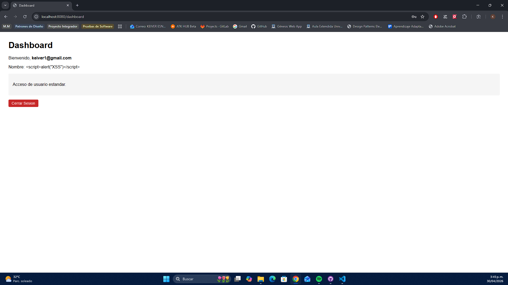
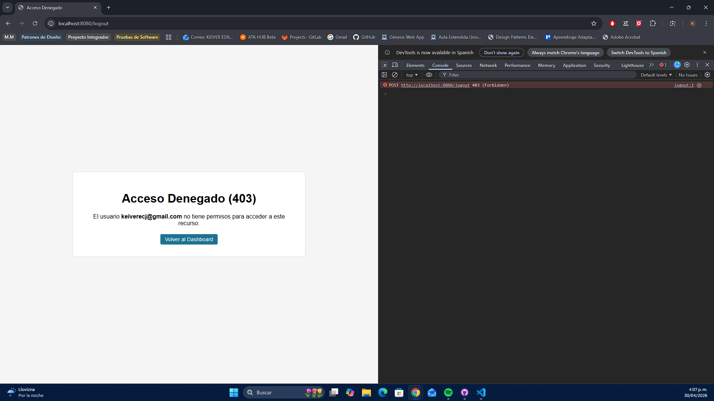
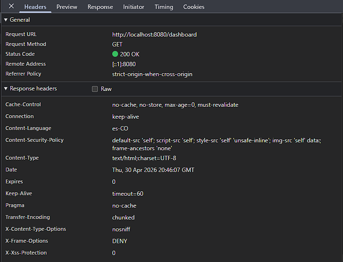
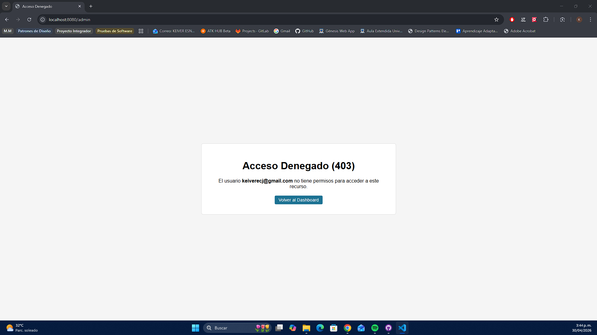

# Seguridad en Aplicaciones Web - Unidad 9

**Universidad:** UDES - Ingeniería de Sistemas (2026)  
**Asignatura:** Programación Web  
**Actividad:** Post-Contenido 2 - Seguridad con Spring Security 6  
**Repositorio:** castellanos-post2-u9

---

Aplicación web profesional para la gestión académica de estudiantes y cursos, implementando estándares empresariales de seguridad con Spring Security.

## Descripción del Proyecto

El Sistema de Gestión de Estudiantes es una plataforma web desarrollada para instituciones educativas que permite administrar el registro de estudiantes, inscripción de cursos y control de accesos mediante roles de usuario.

**Objetivo de la unidad:** Implementar mecanismos de seguridad avanzados en aplicaciones web Java, incluyendo autorización con @PreAuthorize, protección contra ataques XSS/CSRF, configuración de Content Security Policy (CSP) y manejo personalizado de errores de acceso.

---

## Arquitectura del Sistema

```
┌─────────────────────────────────────────────────────────────┐
│                        CLIENTE (Navegador)                  │
│  Thymeleaf Templates + HTML + CSS                          │
└────────────────────────┬────────────────────────────────────┘
                         │ HTTP/HTTPS
                         ▼
┌─────────────────────────────────────────────────────────────┐
│              SPRING BOOT APPLICATION (Puerto 8080)          │
│                                                              │
│  ┌──────────────────┐    ┌────────────────────────────┐    │
│  │  CONTROLLERS     │    │  SECURITY LAYER            │    │
│  │  - AuthController│◄───┤  - SecurityConfig         │    │
│  │  - EstudianteCtr │    │  - CSRF Protection        │    │
│  │  - CursoController│   │  - @PreAuthorize          │    │
│  │  - ErrorController│   │  - CSP Headers            │    │
│  └────────┬─────────┘    └────────────┬───────────────┘    │
│           │                           │                     │
│  ┌────────▼─────────┐    ┌───────────▼──────────────┐     │
│  │  SERVICES        │    │  PERSISTENCE LAYER       │     │
│  │  - UsuarioService│    │  - UsuarioRepository     │     │
│  │  - EstudianteSvc │    │  - EstudianteRepository  │     │
│  │  - CursoService  │    │  - CursoRepository       │     │
│  └──────────────────┘    └───────────┬───────────────┘     │
│                                        │                    │
└────────────────────────────────────────┼────────────────────┘
                                     │
                            ┌────────▼────────┐
                            │  BASE DE DATOS  │
                            │  H2 (En memoria)│
                            └─────────────────┘
```

---

## Tecnologías Utilizadas

| Tecnología      | Versión   | Propósito                            |
| --------------- | --------- | ------------------------------------ |
| Java            | 17 (LTS)  | Lenguaje de programación principal   |
| Spring Boot     | 3.4.5     | Framework de aplicación              |
| Spring Security | 6.x       | Autenticación y autorización         |
| Spring Data JPA | 3.4.5     | Acceso a datos                       |
| Thymeleaf       | 3.1.2     | Motor de plantillas (con escape XSS) |
| H2 Database     | 2.3.232   | Base de datos en memoria             |
| Maven           | 3.9+      | Gestión de dependencias              |
| BCrypt          | 12 rondas | Algoritmo de hash para contraseñas   |

---

## Estructura del Proyecto

```
castellanos-post2-u9/
├── src/
│   ├── main/
│   │   ├── java/
│   │   │   └── com/
│   │   │       └── universidad/
│   │   │           └── estudiantes/
│   │   │               ├── EstudiantesApplication.java
│   │   │               ├── config/
│   │   │               │   └── SecurityConfig.java
│   │   │               ├── controller/
│   │   │               │   ├── AuthController.java
│   │   │               │   ├── EstudianteController.java
│   │   │               │   ├── CursoController.java
│   │   │               │   └── ErrorController.java
│   │   │               ├── model/
│   │   │               │   ├── Usuario.java
│   │   │               │   ├── Estudiante.java
│   │   │               │   └── Curso.java
│   │   │               ├── repository/
│   │   │               │   ├── UsuarioRepository.java
│   │   │               │   ├── EstudianteRepository.java
│   │   │               │   └── CursoRepository.java
│   │   │               └── service/
│   │   │                   ├── UsuarioService.java
│   │   │                   ├── EstudianteService.java
│   │   │                   ├── CursoService.java
│   │   │                   └── UsuarioDetailsService.java
│   │   └── resources/
│   │       ├── application.properties
│   │       └── templates/
│   │           ├── dashboard.html
│   │           ├── error/
│   │           │   └── 403.html
│   │           ├── auth/
│   │           │   ├── login.html
│   │           │   └── registro.html
│   │           ├── admin/
│   │           │   └── panel.html
│   │           ├── estudiantes/
│   │           │   ├── lista.html
│   │           │   ├── formulario.html
│   │           │   └── confirmar-eliminar.html
│   │           └── cursos/
│   │               ├── lista.html
│   │               ├── formulario.html
│   │               └── inscribir.html
│   └── test/
│       └── java/
│           └── com/
│               └── universidad/
│                   └── estudiantes/
│                       └── EstudiantesApplicationTests.java
├── capturas/
│   ├── acceso-denegado-403.png
│   ├── csp-header.png
│   ├── csrf-403.png
│   └── xss-escapado-dashboard.png
├── .gitignore
├── .gitattributes
├── pom.xml
├── mvnw
├── mvnw.cmd
└── README.md
```

---

## Prerrequisitos del Entorno

Para ejecutar esta aplicación, asegúrese de contar con:

- **Java Development Kit (JDK) 17** o superior
  - Verificar: `java -version`
- **Maven 3.9+** (opcional, se incluye Maven Wrapper)
  - Verificar: `mvn -version`
- **Navegador web moderno** (Chrome, Firefox, Edge)
- **Conexión a internet** (solo para descarga inicial de dependencias)

---

## Instrucciones de Ejecución Paso a Paso

### 1. Descargar el proyecto

```bash
git clone https://github.com/KeiverJ/castellanos-post2-u9.git
cd castellanos-post2-u9
```

### 2. Ejecutar la aplicación

**En Windows:**

```bash
mvnw.cmd spring-boot:run
```

**En Linux/Mac:**

```bash
./mvnw spring-boot:run
```

### 3. Acceder a la aplicación

Abrir el navegador y visitar:

```
http://localhost:8080
```

### 4. Usuarios disponibles para pruebas

| Rol           | Correo                    | Contraseña | Acceso                         |
| ------------- | ------------------------- | ---------- | ------------------------------ |
| Administrador | `admin@universidad.com`   | `admin123` | Panel admin + gestión completa |
| Usuario       | `usuario@universidad.com` | `user123`  | Gestión de perfil y cursos     |

_Nota: Si no existen usuarios, regístrese desde la pantalla de inicio._

---

## Funcionalidades Principales

### Para Usuarios (USER)

- **Registro e inicio de sesión** seguro con BCrypt
- **Dashboard personalizado** con nombre del usuario
- **Gestión de perfil** (actualización de nombre)
- **Listado de estudiantes** y cursos
- **Inscripción a cursos** disponibles

### Para Administradores (ADMIN)

- Todas las funcionalidades de usuario, además de:
- **Panel de administración** exclusivo (`/admin`)
- **Gestión de usuarios** (cambiar roles)
- **Gestión completa de estudiantes** (crear, editar, eliminar)
- **Gestión completa de cursos** (crear, editar, eliminar)

### Seguridad Implementada

- **Autorización granular** con @PreAuthorize en capa de servicio
- **Protección XSS** mediante escape automático de Thymeleaf
- **Protección CSRF** con tokens en formularios
- **Content Security Policy** para prevenir inyección de recursos
- **Página de acceso denegado personalizada** (403)

---

## Decisiones de Diseño y Justificación Técnica

### 1. @PreAuthorize en Capa de Servicio

Se decidió aplicar las anotaciones de seguridad en `UsuarioService.java` en lugar del controlador, siguiendo el principio de **defensa en profundidad**. Esto asegura que las reglas de negocio sean ejecutadas independientemente de la capa de presentación.

**Justificación:** Si se agregara una API REST en el futuro, las reglas de seguridad seguirían aplicando sin duplicar código.

### 2. BCrypt con 12 Rondas

```java
return new BCryptPasswordEncoder(12);
```

**Justificación:** 12 rondas proporcionan un equilibrio entre seguridad y rendimiento en 2026. Hace que ataques de fuerza bruta sean computacionalmente costosos.

### 3. Thymeleaf con Escape Automático

Se utiliza `th:text` en lugar de `th:utext` para todos los campos de usuario:

```html
<span th:text="${usuario.nombre}"></span>
```

**Justificación:** Previene inyección XSS incluso si un atacante logra almacenar scripts maliciosos en la base de datos.

### 4. CSRF con CookieCsrfTokenRepository

```java
.csrf(csrf -> csrf
    .csrfTokenRepository(CookieCsrfTokenRepository.withHttpOnlyFalse())
)
```

**Justificación:** Permite que JavaScript lea el token CSRF de la cookie para peticiones AJAX, manteniendo la protección contra ataques cross-site.

### 5. Content Security Policy (CSP)

```
default-src 'self'; script-src 'self'; style-src 'self' 'unsafe-inline'; img-src 'self' data:; frame-ancestors 'none'
```

**Justificación:** Restringe la carga de recursos externos, previniendo ataques de inyección de código y clickjacking.

---

## Flujo de Seguridad y Capturas de Evidencia

### Inicio de Sesión y Dashboard

Al iniciar sesión, el sistema muestra el dashboard con el nombre del usuario autenticado, protegido contra XSS:


_El nombre se muestra usando th:text, escapando cualquier etiqueta HTML maliciosa_

### Protección CSRF Activa

Al intentar enviar un formulario sin el token CSRF (simulando un ataque), el servidor responde con 403 Forbidden:


_Petición POST sin token CSRF rechazada por Spring Security_

### Cabecera CSP Configurada

La aplicación incluye la cabecera Content-Security-Policy en todas las respuestas:


_Cabecera presente verificada en las herramientas de desarrollo del navegador (F12)_

### Manejo de Acceso No Autorizado

Cuando un usuario con rol USER intenta acceder a `/admin`, se muestra la página personalizada de acceso denegado:


_Página personalizada que muestra el usuario autenticado y un mensaje claro de error_

---

## Solución de Problemas Frecuentes

### Error: "Puerto 8080 en uso"

**Solución:** Cambiar el puerto en `application.properties`:

```properties
server.port=8081
```

### Error: "Dependencies could not be resolved"

**Solución:** Verificar conexión a internet y limpiar caché de Maven:

```bash
./mvnw clean
./mvnw spring-boot:run
```

### La página 403 no se muestra correctamente

**Solución:**

1. Verificar que el usuario tenga el rol correcto
2. Asegurar que la carpeta `templates/error/` existe con `403.html`
3. Reiniciar la aplicación después de cambios en templates

### Problemas con caracteres especiales (tildes, ñ)

**Solución:** Verificar que los archivos HTML tengan:

```html
<meta charset="UTF-8" />
```

---

## Documentación de Seguridad

### Verificación de @PreAuthorize

| Método                      | Anotación                                                                                             | Comportamiento Esperado                           |
| --------------------------- | ----------------------------------------------------------------------------------------------------- | ------------------------------------------------- |
| `listarTodos()`             | `@PreAuthorize("hasRole('ADMIN')")`                                                                   | Solo ADMIN puede listar usuarios                  |
| `buscarPorEmail(email)`     | `@PreAuthorize("hasAnyRole('ADMIN','USER') and (#email == authentication.name or hasRole('ADMIN'))")` | Usuario ve su propio perfil o ADMIN ve cualquiera |
| `cambiarRol(id, rol)`       | `@PreAuthorize("hasRole('ADMIN')")`                                                                   | Solo ADMIN puede cambiar roles                    |
| `actualizarNombre(usuario)` | `@PreAuthorize("#usuario.email == authentication.name or hasRole('ADMIN')")`                          | Usuario actualiza su propio nombre                |

### Pruebas de Seguridad Realizadas

1. **XSS:** Inyección de `<script>alert('XSS')</script>` en campo nombre → Se muestra como texto plano
2. **CSRF:** Petición POST sin token → Servidor responde 403 Forbidden
3. **@PreAuthorize:** Usuario USER accede a `/admin` → Redirección a página 403 personalizada
4. **CSP:** Headers verificados en navegador → Política presente en respuesta


